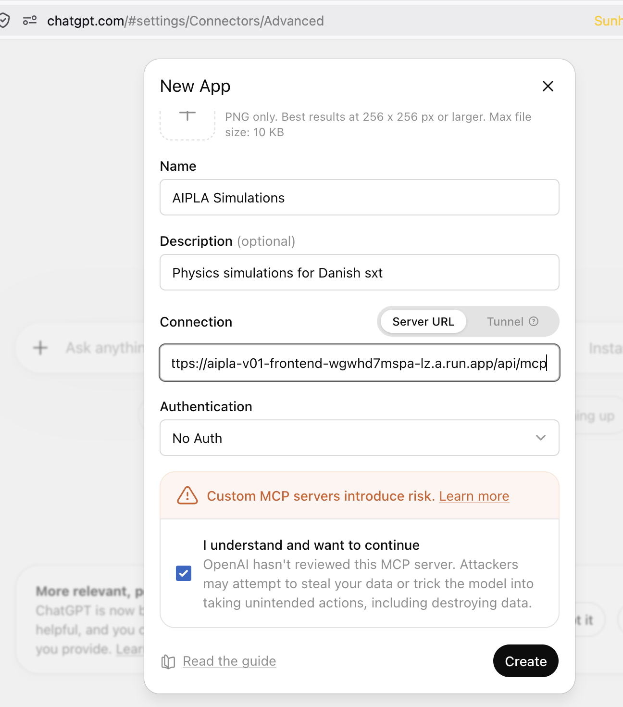
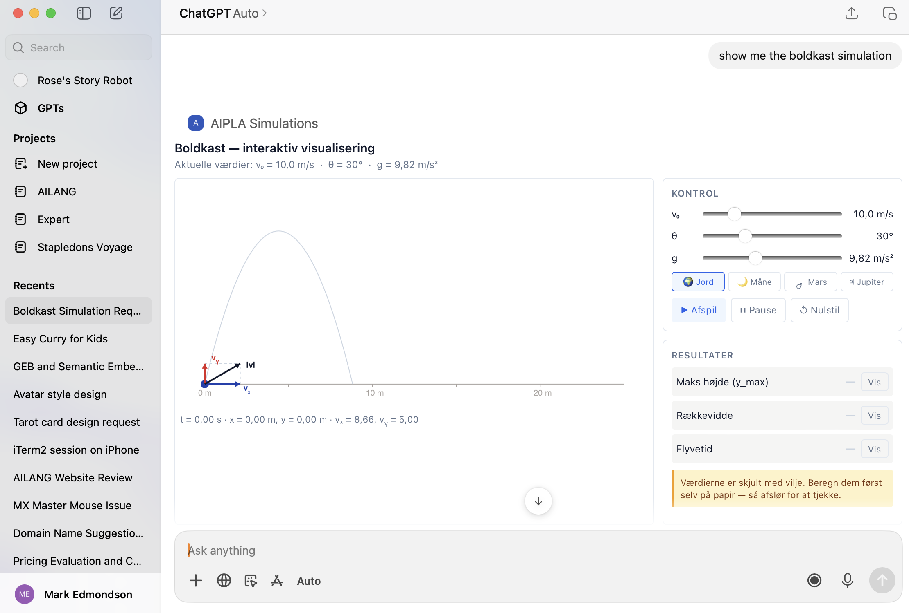

# Slide outline — Build AI UIs Beyond Chat (activity-led)

The talk is a sequence of self-contained decks played in order through
[`presenter.html`](presenter.html). Intro + wrap are instructor decks; the middle
is **student-led activity cards** that double as a self-paced course guide on the
website. This file is the **source of truth** for deck order and per-deck minutes
— keep the `PLAYLIST` in `presenter.html` in sync.

Full pedagogy + running order: [`../agenda.md`](../agenda.md).

**Confirmed slot:** Web Summer Camp, Fri 3 Jul 2026 — two 75-min blocks split by a
hard 30-min coffee break, *not* one 3h run. The break forces Block 1 to end
self-contained, so the Round-B jigsaw is split: **handoff** (`B0`, assign + read)
closes Block 1; **build + teach-back** (`B1`–`B3`) opens Block 2.

| # | Deck | Phase | Min | Status |
|---|---|---|---|---|
| — | [`pre-welcome.html`](pre-welcome.html) | **Pre-roll** — holding screen: self-serve get-ready steps (off-clock, left up as the room fills) | 0 | 🟢 built |
| | **— Block 1 · 10:00–11:15 —** | | | |
| 1 | [`00-welcome.html`](00-welcome.html) | Intro — framing | 5 | 🟡 draft |
| 2 | [`about-mark/about-mark.html`](about-mark/about-mark.html) | Intro — standard | 2 | ✅ reused |
| 3 | [`01-chat-wall.html`](01-chat-wall.html) | Intro — the problem + brain break | 8 | 🟡 draft |
| 4 | [`wire-overview.html`](wire-overview.html) | Guided tour · opens on the **4-layer stack** framer, then the animated **handoff map** + two-worlds split (5 protocols, 3 we build) | 7 | 🟢 built |
| | ↳ [`wire-agui.html`](wire-agui.html) | Tour · **AG-UI** on the wire + the 33-event catalog | 5 | 🟢 built |
| | ↳ [`wire-a2ui.html`](wire-a2ui.html) | Tour · **A2UI** round-trip → catalog/rendered surface → 3 renderers → the A2UI⇄MCP boundary | 4 | 🟢 built |
| | ↳ [`wire-mcp.html`](wire-mcp.html) | Tour · **MCP Apps** by-ref + sandbox + bridge · **closes on Brain break #2** | 6 | 🟢 built |
| 5 | [`A1-explore-a-skill.html`](A1-explore-a-skill.html) | **Round A** — group explore (one live demo) | 20 | 🟢 activity |
| 6 | [`B0-how-it-works.html`](B0-how-it-works.html) | **Round B handoff** — assign protocol + read exercise (pre-break) | 10 | 🟢 activity |
| — | ☕ **hard break** — room empties; **pause the clock** | 11:15–11:45 | 30 | — |
| | **— Block 2 · 11:45–13:00 —** | | | |
| 7 | [`B1-agui.html`](B1-agui.html) | **Round B build** (jigsaw budget banks here) · Phase 1 expert groups | 35\* | 🟢 activity |
| 8 | [`B2-a2ui.html`](B2-a2ui.html) | Round B card · A2UI | 0\* | 🟢 activity |
| 9 | [`B3-mcp.html`](B3-mcp.html) | Round B card · MCP Apps | 0\* | 🟢 activity |
| 10 | [`B4-teach-back.html`](B4-teach-back.html) | **Round B teach-back** — regroup, one expert per protocol (Phase 2) | 0\* | 🟢 activity |
| 11 | [`C1-plan-your-app.html`](C1-plan-your-app.html) | **Round C** — mixed groups **design one app** + reflect | 15 | 🟢 activity |
| 12 | [`show-and-tell.html`](show-and-tell.html) | Share | 15 | 🟡 draft |
| 13 | [`07-wrap-up.html`](07-wrap-up.html) | Wrap-up + meta-reveal + Q&A | 6 | 🟡 draft |
| 14 | [`08-built-on-this.html`](08-built-on-this.html) | Showcase (AIPLA + GDE) | 3 | 🟢 drafted |
| 15 | [`contact-mark/contact-mark.html`](contact-mark/contact-mark.html) | Close — standard | 1 | ✅ reused |
| — | [`wire-sources.html`](wire-sources.html) | **Appendix** — validated sources (off-clock reference) | 0 | 🟢 built |

**Budget:** ~142 min on the clock across the two 75-min blocks (Block 1 ≈ 67 +
~8 slack · Block 2 = 75) + the 30-min hard break off-clock.

\* Round B is a **jigsaw**: handoff `B0` (10 min, pre-break); after the break the
35-min budget banks on `B1`, while `B2`/`B3` are the parallel expert-group cards
(Phase 1) and `B4` is the regroup + teach-back (Phase 2) — all 0-budget tracks the
facilitator projects per group.

## Timekeeping (the organising tool)

The presenter ships a per-deck timer + schedule tracker — use it to run the room:

- **Wall clock, top-right:** click to **start/pause**, double-click to reset.
- **Bottom bar:** `Block M:SS / budget` with a colour bar (green → amber at 80% →
  orange over), `Total M:SS / 145:00`, and a **±delta pill** (green = ahead,
  orange = behind). Budgets are the `minutes` above.
- **Hard break (11:15):** click the clock to **pause** for the full 30-min coffee
  break so the delta stays honest, then click again to resume in Block 2. The room
  empties — make sure `B0` (the handoff) is done before you pause.
- **Round B build:** start the timer when groups begin in Block 2; it banks 35 min
  against `B1` while you flip to `B2`/`B3` to show a track (those read 0:00 — expected).

## Demo thread — two real apps, used throughout

Each protocol is shown as the clean demo skill, then the same protocol shipping in
a real fork of the platform; in Round B groups play with one (homespun vs protocol,
via the dev playgrounds).

- **AIPLA** — *AI in Physics Learning & Assessment* ([cphu-aipla-app](https://github.com/sunholo-data/cphu-aipla-app)) ·
  `https://aipla-v01-frontend-wgwhd7mspa-lz.a.run.app/` (home page — the teacher
  view needs sign-in and 404s otherwise)
- **GDE AP Agent** — *invoice / accounts-payable* ([gde-ap-agent](https://github.com/sunholo-data/gde-ap-agent)) ·
  `https://gde-ap-agent-blqtqfexwa-ew.a.run.app/`

| Protocol | Clean demo skill | Real app | Round B — play with it (key-free unless noted) | Advanced reconstruct |
|---|---|---|---|---|
| AG-UI | `demo-researcher` | GDE pipeline visualizer · AIPLA tutor | `/dev/a2ui` — click, read the annotated AG-UI event stream in the wire log *(no key; DevTools Network is the live alt)* | restore `onMessagesChanged` (`B1`) |
| A2UI | `demo-form-builder` → `demo-workspace` | GDE `InvoiceHeroCard` · AIPLA workspace | `/dev/a2ui` — edit the A2UI JSON, watch it render | restore `default_surface` (`B2`) |
| MCP Apps | **AIPLA sims in ChatGPT** (or local MCP Inspector) — `show_boldkast`/`kinebot`/`led-planck` | GDE dashboards (bidirectional) · the same AIPLA sims inside the tutor | `/dev/mcp-apps/active` — fire both channels through the bridge | restore the `update-model-context` POST (`B3`) |

> **Live-demo caveat:** demo skills run locally (`LOCAL_MODE=1`); the real apps
> are on Cloud Run. The AIPLA card links to the home page (the teacher view needs
> sign-in). Decide per moment whether to click through live or show a capture.

### MCP Apps demo — the AIPLA sims, live in ChatGPT (primary) + local backup

The clean MCP Apps demo is the **portable AIPLA physics sims**. The punchline is
portability: the *same* sim renders in our tutor, in MCP Inspector, **and in
ChatGPT** — which is exactly the "protocol over custom" sell.

**Primary — online, in ChatGPT** (the "it runs anywhere" wow). The deployed AIPLA
app now serves the sims over MCP at
`https://aipla-v01-frontend-wgwhd7mspa-lz.a.run.app/api/mcp` (this resolves the old
"cloud in progress" caveat — the `show_*` apps are served in the backend now). Add
it once as a custom connector:

1. ChatGPT → **Settings → Connectors → Advanced → New App** (developer mode on).
2. **Name:** `AIPLA Simulations` · **Server URL:** the `/api/mcp` URL above ·
   **Authentication:** No Auth · tick *"I understand and want to continue"* → **Create**.
3. In a chat, enable the connector and ask **"show me the boldkast simulation"** —
   the interactive projectile-motion widget renders inline; drag v₀ / θ / g and it
   recomputes live.

| Connector setup | Rendered in ChatGPT |
|---|---|
|  |  |

**Backup — local MCP Inspector** (no cloud, no wifi, always works). If ChatGPT
flakes on the day (connector, cold-start, wifi), fall straight to this:

```bash
npx @modelcontextprotocol/inspector uv run --script \
  /Users/mark/dev/sunholo/cphu-aipla-app/infrastructure/mcp-sandbox/external-host-demo/server.py
```

Inspector shows the wire (`tools/list`, the `ui://` resource) *and* mounts the live
sim — call `show_boldkast` / `show_led_planck`, drag a slider, watch the structured
update flow back as model context. **Demo via Inspector, not Claude Desktop**
(early-2026 Claude Desktop builds mount only the text fallback). Source + runbook:
`cphu-aipla-app/infrastructure/mcp-sandbox/external-host-demo/`.

## Status legend

- ✅ **reused** — standard book-end deck from `sunholo-data/presentations`.
- 🟢 **activity / drafted** — real content; refine copy.
- 🟡 **draft** — framing decks; expand as needed.

The Round-B exercises live in the workshop fork
([build-ai-uis-workshop-app](https://github.com/sunholo-data/build-ai-uis-workshop-app)):
`docs/exercises/{agui,a2ui,mcp}.md` (homespun-vs-protocol + the dev playgrounds),
with the optional reconstruct blanks on the `workshop-start` branch (each anchored
by a test). Built and verified — no longer a TODO.
